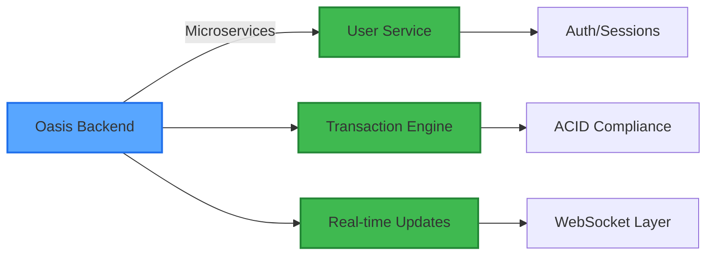

<div align="center">
  
[](https://git.io/typing-svg)


[](https://linkedin.com/in/trentonallan)
[](mailto:allan.tr@northeastern.edu)
[](https://github.com/trentonallan)


</div>

## 🚀 About Me

```python
class TrentonAllan:
    def __init__(self):
        self.location = "Boston, MA"
        self.education = "Northeastern University '28"
        self.focus = ["Distributed Systems", "Backend Architecture", "ML Fundamentals"]
        self.currently = "Building @ Oasis NEU | Seeking Jan-Aug 2026 Co-op"
```


### 🎯 Quick Facts

- 🔨 **Currently:** Backend Engineer @ [Oasis NEU](https://github.com/oasis-neu) - P2P marketplace serving 75+ users
- 🐛 **Open Source:** Fixed critical bug in [node-postgres](https://github.com/brianc/node-postgres) (11K+ stars)
- 🏆 **Recognition:** Dean's List | "Most Valuable Intern" @ Cape Cod Theatre
- 📚 **Learning:** Distributed systems, compiler design, CUDA programming
- 🌱 **Next:** Building [Curio](https://github.com/trentonallan/curio) - Adaptive ML algorithms

<br clear="right"/>

## 💻 Tech Stack

<div align="center">

### Languages


### Backend & Systems


### Tools & Frameworks


</div>

## 🔥 Featured Projects

<div align="center">
  
| 🌐 **Production Systems** | 🛠️ **From-Scratch Implementations** |
|:---:|:---:|
| [](https://github.com/oasis-neu/backend) | [](https://github.com/trentonallan/dartfrog) |
| **Real-time P2P marketplace**<br/>500+ daily API calls, <50ms latency<br/>`Node.js` `PostgreSQL` `WebSockets` | **HTTP/1.1 server (zero dependencies)**<br/>10K+ concurrent connections<br/>`Java` `TCP/IP` `Thread Pools` |
| | [](https://github.com/trentonallan/neural-network-py) |
| | **Pure NumPy implementation**<br/>96% MNIST accuracy, no frameworks<br/>`Python` `NumPy` `Calculus` |

</div>

## 📊 GitHub Analytics

<div align="center">
  
  
</div>

<div align="center">
  
</div>

## 🏗️ What I'm Building



## 🎯 2025-2026 Goals

- [ ] 🚀 Deploy Oasis to 500+ active users
- [ ] 🔧 Contribute to 5+ major open source projects
- [ ] 🧠 Complete distributed systems research project
- [ ] 💼 Land competitive co-op (Jan-Aug 2026)
- [ ] 📚 Maintain Dean's List while building side projects

## 💡 Recent Activity

<!--START_SECTION:activity-->
- 🔨 Architected event-driven backend for Oasis marketplace
- 🐛 Fixed date serialization bug in node-postgres
- 🏆 Selected as "Most Valuable Intern" among 20+ candidates
- 📖 Implementing Klondike solitaire game engine from scratch
- 🔐 Solving multi-layer cryptography challenges in CY2550
<!--END_SECTION:activity-->

## 📈 Contribution Graph

<div align="center">
  
</div>

---

<div align="center">
  
### 💭 Philosophy

```javascript
while (curious) {
    learn();
    build();
    if (!understand) {
        buildFromScratch();
    }
    ship();
}
```


### 📫 Let's Connect!

**Currently seeking Jan-Aug 2026 co-op opportunities**

[📧 Email](mailto:allan.tr@northeastern.edu) • [💼 LinkedIn](https://linkedin.com/in/trentonallan) • [📄 Resume](https://github.com/trentonallan/trentonallan/blob/main/resume.pdf)

</div>

<div align="center">
  
</div>
